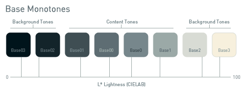
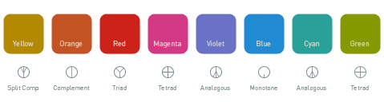

Solarized
=========

## Precision colors for machines and people

Solarized is a sixteen 
color palette (eight monotones, eight accent colors) designed for use with 
terminal and gui applications. It has several unique properties. I designed 
this colorscheme with both precise 
[CIELAB](http://en.wikipedia.org/wiki/Lab_color_space) lightness relationships 
and a refined set of hues based on fixed color wheel relationships. It has been 
tested extensively in real world use on color calibrated displays and in 
a variety of lighting conditions.

Available in formats for:

* **Vim** (the Vim-only portion of Solarized is [available 
here](https://github.com/altercation/vim-colors-solarized), for use with 
Pathogen, etc.)
* **Mutt** e-mail client (*just* the Mutt colorscheme is [available 
here](https://github.com/altercation/mutt-colors-solarized))
* Adobe Photoshop Palette
* GIMP Palette
* Apple Color Picker Palette
* iTerm2
* OS X Terminal.app
* Xresources / Xdefaults

Download
========

**Project Page:**
:   Downloads, screenshots and more information are available from the project 
    page: <http://ethanschoonover.com/solarized>.

**Git repo:**
:   The full git repository is at: <https://github.com/altercation/solarized>.

**Vim only:**
:   The vim-only colorscheme (Pathogen ready) is available at: 
    <https://github.com/altercation/vim-colors-solarized>.

**Mutt only:**
:   The mutt-only variants can be cloned from 
    https://github.com/altercation/mutt-colors-solarized

Note that through the magic of 
[git-subtree](https://github.com/apenwarr/git-subtree) these repositories are 
all kept in sync, so you can pull any of them and get the most up-to-date 
version.

What
----

Solarized is a sixteen color palette (eight monotones, eight accent colors) 
designed for use with terminal and gui applications and has several unique 
properties. It has been designed with both precise 
[CIELAB](http://en.wikipedia.org/wiki/Lab_color_space) lightness relationships 
and a refined set of hues based on fixed color wheel relationships. It has been 
tested extensively in real world use on color calibrated displays and in 
a variety of lighting conditions.

Features
--------

1. **Selective contrast**

    Solarized reduces brightness based contrast in general. Modern display 
    devices are capable of blasting your retina clean off with max brightness 
    and I found my eyes growing tired using high contrast colorschemes, even 
    with the brightness turned down. Solarized reduces *brightness contrast* 
    but, unlike many low contrast colorschemes, retains *contrasting hues* 
    (based on colorwheel relations) for syntax highlighting readability.

2. **Dual modes: Dark/Light**

    I switch between dark and light modes when editing text even when editing
    different types of files. Solarized retains the same selective contrast 
    relationships and overall feel when switching between the light and dark 
    background modes. A *lot* of thought, planning and testing has gone into 
    making both modes feel like part of a unified colorscheme.

3. **16/5 Palette modes**

    Solarized works as a sixteen color palette for compatibility with common
    terminal based applications / emulators. In addition, it has been carefull 
    designed to scale down to a variety of five color palettes (four base 
    monotones plus one accent color) for use in design work such as web design.

4.  **Personality that doesn't crowd out the room**

    Solarized can be used as a pure monotone palette, a five-up monotone+accent 
    colorscheme or in full on sixteen color mode for full syntax highlighting.  
    In every case it retains a strong identity but doesn't overwhelm. Like any 
    good supporting actor, it keeps the story moving without chewing up the 
    scenery.

5.  **Precision**

    The monotones have symmetric CIELAB lightness differences, so switching 
    from dark to light mode retains the same perceived contrast in brightness 
    between each value. Each mode is equally readable. The accent colors are 
    based off specific colorwheel relations and subsequently translated to 
    CIELAB to ensure perceptual uniformity in terms of lightness. The hues 
    themselves, as with the monotone \*A\*B values, have been adjusted within 
    a small range to achieve the most pleasing combination of colors.

Installation
------------

Installation instructions for each version of the colorscheme are included in 
the subdirectory README files. Note that for Vim (and possibly for Mutt) you 
may want to clone the specific repository (for instance if you are using 
Pathogen). See the links at the top of this file.

The colors
----------

SOLARIZED HEX     16/8 TERMCOL  XTERM/HEX   CIELAB     RGB         HSB
--------- ------- ---- -------  ----------- ---------- ----------- -----------
base03    #002a32  8/4 brblack  234 #1c1c1c 15 -12 -09   0  42  50 190 100  20
base02    #17353d  0/4 black    235 #262626 20 -10 -09  23  53  61 193  62  24
base01    #586e75 10/7 brgreen  240 #585858 45 -07 -07  88 110 117 194  25  46
base00    #617c82 11/7 bryellow 241 #626262 50 -09 -07  97 124 130 191  25  51
base0     #839496 12/6 brblue   244 #808080 60 -06 -03 131 148 150 186  13  59
base1     #93a1a1 14/4 brcyan   245 #8a8a8a 65 -05 -02 147 161 161 180   9  63
base2     #eee8d5  7/7 white    254 #e4e4e4 92 -00  10 238 232 213  44  11  93
base3     #fdf6e3 15/7 brwhite  230 #ffffd7 97  00  10 253 246 227  44  10  99
yellow    #b58900  3/3 yellow   136 #af8700 60  10  65 181 137   0  45 100  71
orange    #c45221  9/3 brred    166 #d75f00 50  45  50 196  82  33  18  83  77
red       #cd1e1a  1/1 red      124 #af0000 45  65  50 205  30  26   1  87  80
magenta   #d33682  5/5 magenta  125 #af005f 50  65 -05 211  54 130 331  74  83
violet    #6c71c4 13/5 brmagenta 61 #5f5faf 50  15 -45 108 113 196 237  45  77
blue      #268bd2  4/4 blue      33 #0087ff 55 -10 -45  38 139 210 205  82  82
cyan      #2aa198  6/6 cyan      37 #00afaf 60 -35 -05  42 161 152 175  74  63
green     #859900  2/2 green     64 #5f8700 60 -20  65 133 153   0  68 100  60

