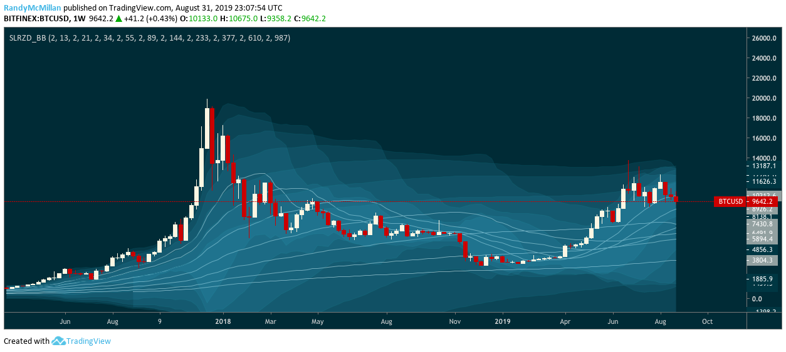

#Solarized for PineScript
====

###This script sets up the Solarized color palette in TradingView.com

		//@version=3
		study("Solarized Color Theme")
		theme = 0 //true 0 false
		transparency = 0
		Base03 = iff(theme == 0, color(#002b36, transparency),color(#fdf6e3, transparency))
		Base02 = iff(theme == 0, color(#003743, transparency), color(#eee8d5, transparency))
		Base01 = color(#586e75, transparency),Base00 = color(#657b83, transparency),Base0  = color(#839496, transparency),Base1  = color(#93a1a1, transparency)
		Base2  = iff(theme == 0, color(#eee8d5, transparency), color(#003743, transparency))
		Base3  = iff(theme == 0, color(#fdf6e3, transparency), color(#002b36, transparency))
		yellow = color(#b58900,transparency) ,orange  = color(#cb4b16,transparency),red     = color(#dc322f,transparency),magenta = color(#d33682,transparency)
		violet = color(#6c71c4,transparency),blue    = color(#268bd2,transparency),cyan    = color(#2aa198,transparency),green   = color(#859900,transparency)
		//We overload standard colors here
		aqua=cyan,black=Base03,fuchsia=magenta,gray=Base1,lime=green,maroon=magenta,navy=blue,olive=green,purple=violet,silver=Base1,teal=cyan,white=Base3
		//End Color Palette Creation
